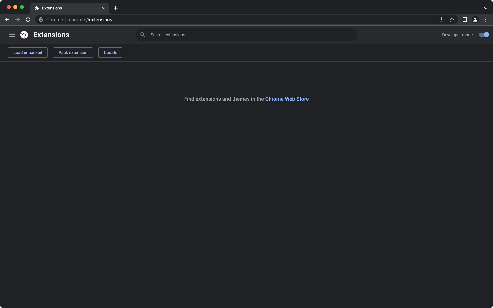

# Currency Converter

A chrome extension for converting between currencies with ease! Written in JavaScript using [React](https://reactjs.org/) and [tailwindcss](https://tailwindcss.com/).

## Installing the extension

> Note: you need a [fixer API key](https://fixer.io/documentation) to use the extension. Make sure to get one before continuing!

Clone the repo with `git clone git@github.com:lucasftz/currency-converter.git` and once in the project directory, you'll need to run the following commands:

```
chmod +x ./scripts/create-extension.zsh
```

```
npm run build
```

You'll be prompted for your API key, so have that on hand. Once done, a `dist` folder should have been created inside the project directory.

Next, go to your browser and navigate to `chrome://extensions`, you should see something that looks like this.



Enable developer mode if it's not already, click `Load Unpacked` and select the `dist` folder. You can now pin the extension to use it whenever you want.
